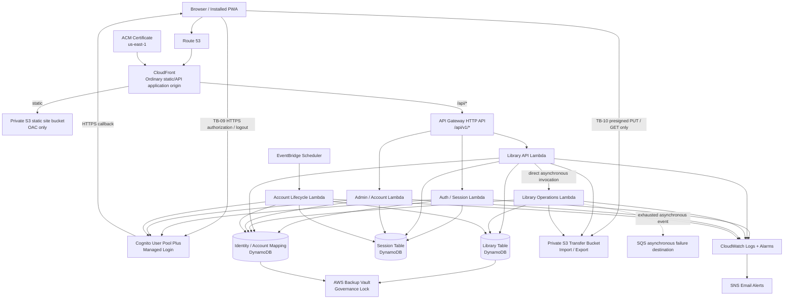
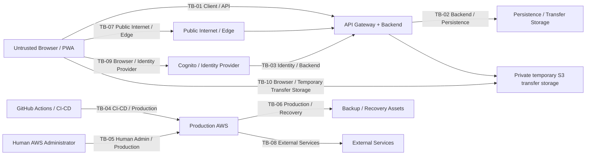

# ShelfState V4 Architecture Baseline

**Status:** Approved Architecture Baseline / Pre-Code Gate cleared 2026-09-15
**Baseline date:** 2026-09-14; gate status updated 2026-09-15
**Implementation status:** Production-code implementation not yet authorized\
**Pre-Code Gate:** **CLEARED** — implementation planning authorized; implementation remains separately gated
**Primary region:** `us-west-2` (Oregon)\
**Edge certificate region:** `us-east-1` for CloudFront ACM certificate

---

## 1. Purpose and authority

This document is the authoritative implementation baseline for ShelfState V4. It consolidates the approved V4 requirements, threat model, security controls, and architecture decisions made during the pre-implementation research phase.

The authority hierarchy is:

1. **`docs/V4_ARCHITECTURE.md`** is the authoritative current-state V4 architecture baseline.
2. **`docs/adr/ADR-001-*.md` through `ADR-025-*.md`** are the authoritative decision history and rationale.
3. **`docs/V4_REQUIREMENTS.md`** is the authoritative implementation requirements registry.
4. **`docs/V4_IMPLEMENTATION_PLAN.md`** describes implementation sequencing derived from the three authorities above. It is subordinate to them and does not itself authorize implementation.
5. If implementation reveals a material architectural change, the relevant ADR must be created or amended first, this baseline and requirements registry must then be updated, and only then may implementation adopt the change.

Code must not silently become the architecture.

This baseline is a synthesis and verification artifact. It does not authorize implementation by itself.

### 1.1 Requirements governance

The architecture discussion referred to a historical 196-item V4 requirements ledger. That ledger is unavailable and cannot be reliably reconstructed. The repository-controlled [`V4_REQUIREMENTS.md`](V4_REQUIREMENTS.md) formally supersedes it for implementation governance; it does **not** claim verbatim or one-to-one equivalence.

The canonical registry is derived from this baseline, ADR-001 through ADR-025 and their approved amendments, the named assets/trust boundaries/threats/controls, relevant V3 behavior, the first audit, and the 2026-09-14 human adjudications. Pre-Code clearance requires the registry to be complete and independently reviewed, with every material requirement traceable to architecture/control decisions and a planned verification mechanism.

---

## 2. Project context

ShelfState is a vanilla JavaScript personal-library application. V3.9 is a completed local-first PWA and remains the stable production application at its existing Netlify deployment.

V4 introduces a cloud-authoritative architecture while preserving the existing domain model and the project's preference for simple, explicit architecture.

### 2.1 V3 relationship

V3 and V4 are operationally separate products during V4 development.

- V3.9 remains frozen and stable.
- V4/cloud work must not be deployed into or coupled to the existing Netlify V3 application.
- V3 is not a V4 synchronization peer.
- Migration from V3 to V4 occurs through explicit export/import.
- V4 owns legacy-format compatibility logic; V3 is not modified to emit the V4 format.

### 2.2 Existing domain model retained

The V4 domain continues to center on Books and Bookshelves. `Book.bookshelfId` remains the canonical relationship.

Representative Book fields include:

- `id`
- `title`
- `author`
- `pages`
- `progress`
- `startDate`
- `endDate`
- `isbn`
- `notes`
- `classification`
- `category`
- `status`
- `bookshelfId`
- `createdAt`
- `updatedAt`

Bookshelf identity and default-shelf behavior are server-authoritative domain invariants. Every active library has exactly one explicit default Bookshelf. Its default shelf cannot be deleted through ordinary operations. Shelf names are trimmed and case-insensitively unique within a user's active library. `Book.bookshelfId` is the only membership relationship; no `Bookshelf.bookIds` reverse mirror is permitted. Deleting a non-default shelf is one logical operation that first reassigns all affected Books to the default and then removes the shelf.

---

## 3. V4 goals

V4 must provide:

- AWS-hosted production deployment;
- secure authentication;
- server-side authorization and user-data isolation;
- cloud-authoritative persistence;
- safe multi-device evolution later;
- complete import/export and V3 migration;
- backup and disaster recovery;
- secure public-internet deployment;
- explicit cost containment;
- reproducible infrastructure and deliberate production releases;
- a future path to public signup without replacing the identity model.

### 3.1 V4.0 non-goals

V4.0 intentionally does **not** require:

- offline write capability;
- guaranteed offline read capability;
- real-time multi-device synchronization;
- push updates/websockets;
- sharing/joint ownership;
- organizations or complex ACLs;
- a dedicated search service;
- a dedicated analytics platform;
- a generalized RBAC/policy engine;
- multi-region active deployment;
- a customer-managed VPC;
- public self-service registration;
- AWS WAF at invite-only launch;
- distributed tracing;
- a custom CloudWatch dashboard;
- a formal SBOM;
- rich text/Markdown user content;
- framework migration away from vanilla JavaScript.

---

## 4. Governing architecture principles

1. **Cloud authoritative.** V4 cloud state is authoritative. Browser state is never a second source of truth.
2. **Browser is untrusted.** All authentication-dependent identity, authorization, ownership, validation, and domain invariants are enforced server-side.
3. **Ownership by construction.** User data is scoped by the authenticated immutable ShelfState `userId` at datastore access construction, not by post-filtering or client-supplied identity.
4. **Simple managed services.** Operational complexity must earn a concrete security, reliability, performance, or cost benefit.
5. **Low idle cost.** Prefer usage-driven/serverless services and avoid always-on infrastructure without a requirement.
6. **No speculative scale architecture.** Build for the actual personal/invite-only workload while preserving clean evolution paths.
7. **Server time/revision authority.** Client clocks are not trusted for concurrency or conflict resolution.
8. **Explicit failure behavior.** Partial, stale, invalid, or ambiguous operations fail safely rather than silently overwriting authoritative state.
9. **Reproducible infrastructure.** Production infrastructure is IaC-authoritative.
10. **Deliberate production changes.** Merge does not equal production deployment.
11. **Privacy by default.** Data collection, logging, and retention are minimized to their operational purpose.
12. **Cost is an architecture constraint.** Expected monthly cost is calculated before implementation and again before meaningful scale expansion.

---

## 5. Runtime architecture



### 5.1 Normal browser path

The supported path for ordinary ShelfState application traffic is one origin:

- `/*` → CloudFront → private S3 static origin;
- `/api/*` → CloudFront → API Gateway HTTP API → Lambda.

The browser sees one ShelfState application origin for static and API traffic. This simplifies session-cookie behavior and avoids unnecessary application API CORS complexity. Two explicit, narrowly bounded cross-origin flows remain: browser navigation to Cognito Managed Login (TB-09) and direct transfer-object access using presigned S3 URLs (TB-10). Neither flow receives the ShelfState session cookie.

The API Gateway default `execute-api` endpoint remains enabled in V4.0 as the CloudFront origin. The backend must remain secure if that endpoint is reached directly; CloudFront traversal is not an authorization boundary.

---

## 6. Trust boundaries



Approved trust boundaries:

- **TB-01:** client / API
- **TB-02:** backend / persistence
- **TB-03:** identity / backend
- **TB-04:** CI/CD / production
- **TB-05:** human administrator / production
- **TB-06:** production / recovery
- **TB-07:** public internet / edge
- **TB-08:** external services
- **TB-09:** browser / identity provider. Browser navigation uses HTTPS and exact allowed redirect/logout URLs. OAuth `state`, PKCE S256, OIDC `nonce`, a transient browser-binding cookie, and a short-lived single-use server transaction bind the callback. Cognito tokens never become browser-JavaScript-accessible, and CSP navigation/connect policy permits only required endpoints.
- **TB-10:** browser / temporary transfer storage. Presigned URLs are short-lived bearer material limited to one randomized operation-specific key, exact action/method, bounded size, and restricted content type where practical. S3 CORS permits only required V4 origin/methods/headers. There is no listing, general bucket access, browser AWS credential, or ShelfState-cookie authorization. URLs are never logged and uploads remain untrusted until backend validation succeeds.

---

## 7. Assets

Approved protected asset classes:

| Asset | Description |
|---|---|
| A-01 | Private library data |
| A-02 | Authentication/session material |
| A-03 | Cloud administration and deployment authority |
| A-04 | Backups and recovery capability |
| A-05 | Operational/audit telemetry |
| A-06 | Source, IaC, and build artifacts |
| A-07 | Domain, DNS, TLS, and public endpoint identity |

---

## 8. Threat model

### 8.1 Threats and priority

| Threat | Description | Priority |
|---|---|---|
| T-01 | Authenticated users remain untrusted | P1 |
| T-02 | Compromised valid sessions | P1 |
| T-03 | Hostile/modified client | P1 |
| T-04 | Stored/reflected XSS | P1 |
| T-05 | CSRF | P2 |
| T-06 | Broken object-level authorization / IDOR | P1 |
| T-07 | Broken function-level authorization | P1 |
| T-08 | Credential stuffing, brute force, recovery abuse | P2 |
| T-09 | Account enumeration | P3 |
| T-10 | Malicious import payloads | P1 |
| T-11 | Resource exhaustion / cost amplification | P1 |
| T-12 | Supply-chain compromise | P2 |
| T-13 | CI/CD compromise | P1 |
| T-14 | AWS administrator credential compromise | P1 |
| T-15 | Cloud misconfiguration exposure | P1 |
| T-16 | Application-induced corruption or data loss | P1 |
| T-17 | Accidental destructive user actions | P2 |
| T-18 | Backup compromise | P1 |
| T-19 | Sensitive leakage through logs | P2 |
| T-20 | Secret exposure | P1 |
| T-21 | DNS/TLS misconfiguration | P3 |
| T-22 | Identity-provider failure/compromise | P2 |
| T-23 | Export abuse / exfiltration | P2 |
| T-24 | Replay / duplicate writes | P2 |
| T-25 | Stale or incompatible client | P2 |

### 8.2 Approved control catalog

| Control | Description |
|---|---|
| C-01 | Layered user-data isolation |
| C-02 | Bounded/revocable sessions |
| C-03 | Data integrity/recovery |
| C-04 | Secure-by-default IaC |
| C-05 | Layered XSS prevention |
| C-06 | Bounded resource consumption |
| C-07 | Constrained CI/CD deployment authority |
| C-08 | Protected recovery assets |
| C-09 | Secret lifecycle control |
| C-10 | Explicit privileged-operation authorization |
| C-11 | Hardened import boundary |
| C-12 | Server-authoritative trust |
| C-13 | Managed authentication abuse protection |
| C-14 | Minimal/sanitized logging |
| C-15 | Architecture-appropriate CSRF protection |
| C-16 | Destructive-action safeguards |
| C-17 | Replay-safe mutation handling |
| C-18 | Isolated identity dependency |
| C-19 | Enumeration-resistant identity flows |
| C-20 | Managed endpoint identity |
| C-21 | Hardened AWS administration |
| C-22 | Supply-chain hygiene |
| C-23 | Protected bulk export |
| C-24 | Safe client compatibility |
| C-25 | Authentication does not imply trust |

---

## 9. Identity, authentication, sessions, and CSRF

### 9.1 Identity provider

Use **Amazon Cognito User Pools, Plus plan**, with:

- Managed Login;
- OAuth 2.0 Authorization Code + PKCE;
- public OAuth application client;
- no client secret in the PWA;
- `PreventUserExistenceErrors=ENABLED`;
- separate production and non-production user pools;
- Cognito built-in email delivery initially;
- no Cognito Lambda triggers initially;
- no Cognito Identity Pool in V4.0.

Cognito Plus is selected for compromised-credential detection, adaptive/risk protections, and richer authentication-event signals. Threat protection should begin in audit/observation mode before enforcement.

### 9.2 ShelfState identity is independent of Cognito identity

Cognito `sub` is not the permanent ownership identifier.

ShelfState creates an immutable internal `userId` and maintains a server-controlled mapping:

`COGNITO#<sub>` → `ShelfState userId`

The identity/account store also maintains account status, role, and session version as appropriate.

Email address is not the ownership key and does not automatically link identities. Future federation must use explicit verified linking; matching email alone is insufficient.

### 9.3 OAuth/OIDC login transaction

Each Authorization Code + PKCE attempt creates a short-lived, single-use server-side login transaction. The server generates a cryptographically unpredictable OAuth `state`, PKCE `code_verifier`, `S256` `code_challenge`, OIDC `nonce`, and transient browser-binding value. The server record stores the state, hashed binding value, verifier, nonce, allowlisted intended return path, `createdAt`, `expiresAt`, and status/used marker. The raw binding is carried only in a short-lived `Secure`, `HttpOnly` cookie. An initial lifetime of approximately ten minutes is acceptable.

Before creating an authenticated ShelfState session, the callback must verify that the returned state resolves to a real, unexpired and unused transaction; the browser binding matches; the code exchange succeeds with the stored verifier; the ID token is valid for the configured issuer, client, and lifetime; the nonce matches; and the callback/return destination is explicitly allowed. The transaction is atomically consumed exactly once. Replay fails safely. Tokens and the PKCE verifier are never exposed to browser JavaScript. Server-side expiry is authoritative; DynamoDB TTL is cleanup only.

### 9.4 Just-in-time account provisioning

An invitation does not create a ShelfState account. On first successful authenticated access:

1. Cognito authenticates the user.
2. The backend validates the invitation when invite-only registration applies.
3. The backend conditionally provisions exactly one ShelfState account and immutable `userId` for the principal.
4. Identity mapping becomes server-authoritative.

The client cannot choose `userId`, role, or ownership partition.

### 9.5 BFF session model

Cognito tokens are not stored in browser-accessible storage.

The backend performs the authorization-code callback/exchange and stores required Cognito token material server-side. The browser receives only a random opaque application session cookie.

Session storage is a dedicated DynamoDB table keyed by random opaque session ID and includes enough state to enforce:

- `userId`;
- Cognito principal;
- `createdAt`;
- idle/absolute expiry;
- account `sessionVersion` at creation;
- required Cognito token material.

Server-side expiry is authoritative; DynamoDB TTL is cleanup only.

### 9.6 Session policy

Initial policy:

- BFF idle timeout: **7 days**;
- BFF absolute lifetime: **30 days**;
- Cognito access/ID token: **1 hour**;
- rotating Cognito refresh token: **30 days**;
- fresh authentication required for explicitly sensitive operations.

Cookie requirements:

- `Secure`;
- `HttpOnly`;
- host-only;
- narrowest practical path;
- `SameSite=Lax` initial target, changed only if validated authentication behavior requires it.

Successful login creates a brand-new cryptographically unpredictable session identifier. Pre-authentication state is never elevated in place.

### 9.7 Revocation

Each session carries the account's current `sessionVersion`.

- Normal logout deletes only the current session.
- Global logout increments account `sessionVersion`, invalidating all ShelfState sessions immediately.
- Account disablement also increments `sessionVersion`.
- Cognito-side token/session revocation is defense in depth, not the sole revocation mechanism.

### 9.8 CSRF

State-changing cookie-authenticated requests require a separate session-bound anti-CSRF token sent in a custom header.

Defense in depth includes:

- anti-CSRF token validation;
- `SameSite` cookie policy;
- restrictive origin handling;
- correct HTTP methods;
- no reliance on `SameSite` alone.

CSRF tokens are regenerated at session establishment and meaningful security-boundary transitions, not on every request.

### 9.9 Fresh authentication

Recent authentication is required for a narrowly defined sensitive set, including account deletion, identity/email changes, and privileged administrative account-state/role operations. Ordinary library work does not require repeated reauthentication.

---

## 10. Authorization and ownership

Authorization is enforced in the ShelfState backend/data-access layer. Amazon Verified Permissions/Cedar is **not** used in V4.0.

### 10.1 Role model

Initial roles:

- `USER`
- `ADMIN`

ADMIN is a function-level role, not a superuser right to browse private libraries.

Library operations always require resource ownership, including when the caller is an ADMIN.

### 10.2 Ownership enforcement

Every user-owned datastore operation is scoped from authenticated server-resolved `userId`.

Rules:

- handlers do not accept a target owner `userId` for ordinary self-service operations;
- the datastore query/partition is constructed for the authenticated owner before data is read;
- cross-user records are never fetched and then filtered client-side or after authorization;
- client-provided IDs never widen ownership scope;
- collections and bulk operations are owner-scoped at query construction;
- import/export are intrinsically scoped to the authenticated owner.

For user-owned resources, **not found** and **belongs to another user** return the same 404-style response.

### 10.3 Admin authorization

Admin state is ShelfState server-controlled account state, not a Cognito claim treated as authoritative.

Admin privileges are bootstrapped through an explicit controlled administrative/deployment procedure. There is no “first user becomes admin,” signup-order rule, or email-based automatic promotion.

Routine in-app role management is not provided initially. Role changes are privileged and auditable.

Application role and workload authority are distinct. An `ADMIN` may manage invitations and account lifecycle only through authorized functions and may not routinely browse another user's library. A backend lifecycle or recovery workload may have narrowly scoped technical IAM authority to execute an already-authorized workflow, but that authority is target-bound, condition-checked, and auditable; it is not human ownership or general cross-user browsing authority.

### 10.4 Audit behavior

Audit:

- privileged administrative operations;
- role/account-state changes;
- meaningful authorization failures;
- repeated suspicious ownership-boundary attempts.

Do not log every routine successful ownership check.

---

## 11. Persistence architecture

### 11.1 Primary datastore

Use **Amazon DynamoDB Standard table class, On-Demand capacity** as the V4 authoritative datastore.

No relational datastore is used in V4.0. ADR-002 (relational implementation selection) is closed as **not applicable** because ADR-001 selected DynamoDB.

### 11.2 Library table

Use a single main library table for Books and Bookshelves.

Conceptual partition key:

```text
PK = USER#<userId>
```

Books and shelves share the user's item collection. `Book.bookshelfId` remains the authoritative relationship; do not create relationship mirror items or restore the old shelf `bookIds` concept.

Avoid secondary indexes unless a concrete server-side query requirement makes one necessary. Search, filtering, grouping, and Insights remain client-side over the bounded loaded library in V4.0.

The backend enforces the Bookshelf invariants in §2.2 on every write, import, migration, and activation. Case-insensitive name uniqueness is checked over the bounded active library; no GSI is introduced solely for this invariant. A non-default shelf delete atomically reassigns affected Books to the default before removing the shelf. It may use an in-place DynamoDB transaction when the complete operation fits safely inside transaction limits; otherwise it uses the generation protocol below.

### 11.3 Generation model

Large replace/import/structural operations use generations because DynamoDB transaction limits are too small for arbitrary full-library replacement.

Conceptual keys:

```text
PK = USER#123
SK = CONTROL
SK = GEN#G8#BOOK#<bookId>
SK = GEN#G8#SHELF#<shelfId>
```

The server-managed CONTROL record contains, conceptually:

```text
activeGeneration
libraryRevision       # monotonically increasing
activeOperation       # optional exclusive writer-fence metadata
```

`activeOperation` binds an expiring, recoverable exclusive lease to an `operationId`, source generation, source library revision, ownership/attempt marker, and expiry/recovery metadata. It is correctness state, not a best-effort advisory lock.

Coherent whole-library read/export path:

1. strongly read CONTROL and capture `activeGeneration` plus `libraryRevision`;
2. query every page of the captured active generation;
3. strongly read CONTROL again;
4. accept and construct the logical library only if both captured values are unchanged; otherwise discard and retry or fail safely.

Strongly consistent DynamoDB item reads do not provide multi-item snapshot isolation; the double-CONTROL protocol is the coherence test.

Whole-library replacement:

1. conditionally acquire the writer fence, bound to operation ID, source generation, and source library revision;
2. read the stable source state;
3. validate the proposed state and stage a complete new generation in bounded writes;
4. verify the staged generation and all server-authoritative invariants;
5. conditionally activate only while the same operation still owns an unexpired/recovered-valid fence and source generation/revision still match;
6. atomically switch `activeGeneration`, increment `libraryRevision`, and release the fence;
7. retain the prior generation for approximately **24 hours** for convenient rollback, followed by controlled cleanup.

While an exclusive generation operation owns the fence, ordinary mutations that could invalidate it fail safely with a stable 409-class conflict. A worker that loses the fence cannot activate. Lease expiry/recovery prevents a dead worker from creating a permanent lock; recovery is conditional and cannot permit two activators.

TTL may be a cleanup safety net but is never correctness logic.

### 11.4 Entity revisions and concurrency

Mutable Book/Bookshelf entities carry server-managed integer revision/version metadata. Every accepted ordinary mutation executes one atomic transaction that:

1. verifies the client's `expectedGeneration` equals CONTROL `activeGeneration`;
2. verifies no incompatible exclusive `activeOperation` owns the writer fence;
3. verifies `expectedEntityRevision` when the resource already exists;
4. modifies the target domain state while preserving all library invariants; and
5. increments CONTROL `libraryRevision`.

The stale-client token is therefore `expectedGeneration + expectedEntityRevision`; entity revision alone is insufficient across generation activation. Creates participate in the generation/fence/library-revision checks even though no prior entity revision exists. Updates/deletes use conditional writes and reject stale state rather than silently overwriting it.

Server timestamps/revisions are authoritative. Client clocks are not used to choose winners.

### 11.5 Reads

Use strongly consistent base-table reads for authoritative library/entity retrieval by default. Eventual consistency may be introduced later only for an explicitly acceptable use case.

### 11.6 Streams and sync readiness

DynamoDB Streams are **off in V4.0**.

The schema preserves a future path for record-level synchronization through revisions and server timestamps, but V4.0 does not introduce a dedicated change log, tombstones, or sync engine.

### 11.7 Item size and object storage

Books and Bookshelves remain self-contained DynamoDB items within deliberately bounded application limits. Notes are not split to S3 without a concrete size requirement.

Object storage is used only for truly file-like concerns such as import/export transport.

---

## 12. Resource identifiers

Book and Bookshelf IDs are:

- opaque;
- immutable;
- non-semantic;
- independent of ownership and authorization.

New V4.0 online-created resources use backend-generated **UUID v4** identifiers.

IDs do not encode:

- `userId`;
- email;
- bookshelf name;
- timestamp/order;
- application privilege.

Supported V3 IDs are preserved during migration rather than rewritten solely for format uniformity.

Knowing or supplying an ID conveys no authority.

The identity contract remains compatible with a future offline architecture that may need independently generated globally unique IDs.

---

## 13. API and backend compute

### 13.1 Compute and API gateway

Use:

- **API Gateway HTTP API**;
- **AWS Lambda** request-driven compute;
- **Node.js / JavaScript** backend.

Do not use always-on App Runner/ECS/Fargate for V4.0.

Provisioned Concurrency is not used initially. Occasional serverless cold-start latency is an accepted tradeoff for low idle cost.

### 13.2 Lambda granularity

Initial deployment boundaries are approximately:

- Auth / Session Lambda;
- Library API Lambda;
- Library Operations Lambda for bounded asynchronous work;
- Admin / Account Lambda;
- Account Lifecycle Lambda for delayed destructive lifecycle execution.

These are security/capability deployment boundaries, not independent microservices.

Further decomposition requires a concrete IAM, performance, deployment, or operational benefit.

### 13.3 Reserved concurrency

Production Lambdas receive explicit reserved-concurrency ceilings sized comfortably above legitimate demand but low enough to bound runaway execution and downstream resource use. Exact values are established through testing before production.

### 13.4 Session authentication placement

Opaque BFF sessions are validated inside centralized backend authentication middleware, not API Gateway JWT authorization and not a separate Lambda authorizer in V4.0.

For each protected request the backend resolves:

1. session cookie;
2. session record and expiry;
3. current ShelfState account;
4. ACTIVE status;
5. current `sessionVersion`;
6. trusted authenticated `userId`.

### 13.5 API style and versioning

Use resource-oriented HTTP/JSON with conventional HTTP semantics plus explicit command/workflow endpoints where CRUD semantics are misleading.

Initial namespace:

```text
/api/v1/...
```

Backward-compatible changes evolve within v1. Genuinely incompatible contracts require a controlled transition or new major version.

No GraphQL or generalized RPC framework is introduced initially.

### 13.6 OpenAPI

A version-controlled **OpenAPI specification** is the authoritative external API contract.

Implementation and tests must remain consistent with it. Code generation is optional.

### 13.7 Application idempotency

Operations whose replay can create duplicate resources or duplicate logical side effects require a client-supplied idempotency key. This includes create Book, create Bookshelf, create invitation, import replace/merge, structural/generation operations, whole-library migrations, and future command endpoints with comparable replay risk.

The server scopes the record by authenticated ShelfState `userId`, operation type, and idempotency key and stores a canonical request fingerprint, resource/operation result, status, and created/expiry timestamps for a bounded retry window. Same key plus the same logical request returns or resumes the original result without repeating the side effect. The same key with a materially different request returns `IDEMPOTENCY_CONFLICT`. Server-generated resource IDs are retained. Records do not retain full private request bodies unless strictly necessary. Server-enforced expiry is authoritative; TTL is cleanup only. Naturally idempotent reads and safe resource-addressed updates need no key unless their actual semantics introduce independent replay risk.

### 13.8 Asynchronous operation resources

Potentially long-running work never holds an API Gateway request open. After authentication, authorization, boundary validation, and idempotency handling, the Library API creates an ownership-scoped `Operation` record in `QUEUED`, directly invokes the Library Operations Lambda asynchronously, and returns `202 Accepted` with `operationId` and a status URL. The authenticated owner polls `GET /api/v1/operations/{operationId}` with reasonable backoff; another owner observes the normal indistinguishable 404 response.

The asynchronous invocation contains only a bounded, non-secret operation reference/routing envelope; it contains no import body, token, cookie, presigned URL, or private library content. The worker loads the authoritative owned Operation, conditionally transitions safe states, acquires the generation fence when required, performs bounded work, validates before activation, and records `SUCCEEDED` or a sanitized `FAILED` result. Delivery and execution are idempotent and retry-safe. AWS Lambda asynchronous invocation is the primary dispatcher; Step Functions and SQS are not. A low-volume, access-controlled, bounded-retention SQS queue is allowed only as a durable on-failure destination after Lambda exhausts retries.

This model applies to import, export generation, whole-library schema migration, oversized shelf deletion/reassignment, and other generation rebuilds. Ordinary CRUD stays synchronous. Before production, benchmark maximum supported inputs in the real non-production AWS stack. If workloads cannot finish with substantial margin inside the normal Lambda execution limit, stop for architecture review; do not silently introduce another execution platform.

### 13.9 Derivable initial workflow surface

This is an architecture-level representability check, not an OpenAPI specification or implementation plan. The v1 contract can represent the required workflows without changing architecture:

| Workflow | Contract shape | Execution |
|---|---|---|
| Library load | `GET /api/v1/library` | synchronous coherent whole read |
| Book CRUD / move | `/api/v1/books` and `/api/v1/books/{bookId}` | synchronous; mutation carries generation/entity preconditions |
| Shelf create/rename/delete | `/api/v1/bookshelves` and `/api/v1/bookshelves/{bookshelfId}` | create/rename synchronous; delete synchronous if bounded, otherwise operation resource |
| Import/export/migration | explicit command resources under `/api/v1/imports`, `/exports`, `/migrations` | asynchronous `202` operation |
| Invitation/account administration | admin-scoped invitation/account command resources | synchronous command or accepted lifecycle workflow as specified |
| Account disable/delete/cancel | account lifecycle command resources | immediate state change; scheduled deletion worker where applicable |
| Operation status | `GET /api/v1/operations/{operationId}` | synchronous owned status read |

The future version-controlled OpenAPI document must choose exact request/response schemas and route spelling within these boundaries and include stable 409 conflicts for stale generation/entity revision, active writer fence, and idempotency mismatch.

---

## 14. Error handling contract

Application-generated failures use appropriate HTTP status codes plus a small sanitized JSON envelope containing:

- stable machine-readable ShelfState error code;
- safe client-facing message;
- correlation identifier when available;
- bounded field-level issues only where useful.

Never return raw:

- AWS exceptions;
- stack traces;
- table/partition keys;
- tokens/session identifiers;
- configuration details;
- internal persistence structure.

Approved semantics:

- `400` — malformed/domain-invalid input;
- `401` — authentication failure;
- `403` — safe function-level privilege denial where it does not disclose protected resource existence;
- `404` — nonexistent or out-of-owner-scope user resource;
- `409` — stale revision, generation conflict, idempotency conflict, invalid concurrent state transition;
- `429` — throttled/rate limited;
- `503` — retryable temporary unavailability where appropriate.

Use `Retry-After` when meaningful.

Clients must tolerate infrastructure-generated CloudFront/API Gateway responses that do not match the ShelfState envelope and fall back safely based on status rather than exposing raw infrastructure text.

---

## 15. Request validation and bounded resource use

All client input is untrusted.

### 15.1 Boundary schema validation

Every API operation validates its request against an explicit server-side schema before domain/persistence work.

Client-side validation is UX only.

Write contracts reject unexpected properties by default.

Validation enforces:

- required/optional fields;
- types;
- enum values;
- lengths and ranges;
- identifier syntax;
- shallow allowed structure;
- bounded collection sizes.

### 15.2 Resource limits

Define application-level upper bounds for every potentially unbounded dimension, including:

- title/author/notes sizes;
- import size;
- bulk operation target counts;
- IDs per bulk request;
- pagination page size;
- validation issues returned;
- request-body sizes;
- map/list sizes.

AWS quotas are outer guardrails, not the application policy.

### 15.3 Formats and typing

Normal API endpoints accept explicitly supported media types, primarily JSON.

- unsupported media types → `415`;
- no general multipart/binary/XML/form surface in the normal API;
- file transfer uses the dedicated S3 transport path.

Use strict typing. Do not broadly coerce strings into numbers/booleans or guess malformed client intent.

### 15.4 User-authored text

Titles, authors, notes, and similar fields are plain text in V4.0.

Do not rely on generic input stripping as the primary XSS defense. Render stored user content through safe text-oriented APIs. Rich text/Markdown requires a separate security design if introduced later.

---

## 16. Frontend hosting, edge, and PWA behavior

### 16.1 Hosting

Use a **private S3 bucket behind CloudFront using Origin Access Control (OAC)**.

- no public S3 website endpoint;
- no Amplify Hosting;
- CloudFront pay-as-you-go rather than the restrictive flat-rate Free plan;
- Route 53 Alias to CloudFront;
- non-exportable ACM public certificate in `us-east-1`.

### 16.2 Single origin

CloudFront provides one browser-visible production origin.

- static requests → private S3;
- `/api/*` → API Gateway HTTP API.

Authenticated API responses are not cached by CloudFront.

### 16.3 Caching contract

Caching is artifact-specific:

- `index.html` / mutable entry shell → revalidate; CloudFront minimum TTL 0;
- service-worker script → revalidate; minimum TTL 0;
- content-hashed/versioned JS/CSS/images → long-lived immutable caching;
- `/api/*` → no CloudFront response caching;
- mutable metadata such as manifest → short/revalidated as appropriate.

Deployment correctness does not depend on broad CloudFront invalidations.

### 16.4 Security headers

Use a custom IaC-managed CloudFront Response Headers Policy for browser-facing protections including:

- application-specific Content Security Policy;
- HSTS;
- `X-Content-Type-Options: nosniff`;
- Referrer Policy;
- framing protection.

Exact CSP is finalized and tested before implementation completion. Do not introduce Lambda@Edge merely to inject headers.

### 16.5 Frontend release atomicity

Publish immutable/versioned assets before mutable entry points.

Required deployment ordering conceptually:

1. upload new hashed assets;
2. verify they exist;
3. publish mutable metadata;
4. publish `index.html` last;
5. update service-worker entry only after referenced assets are ready.

Retain old hashed assets for a bounded period so already-open clients remain coherent during rollout/rollback.

### 16.6 PWA client compatibility

Do not assume installed PWAs refresh immediately.

Within one API major version, the backend remains compatible with at least the immediately preceding supported production client during rollout.

Clients send a non-sensitive build/version identifier for diagnostics and compatibility handling. This identifier is not security state.

New frontend builds do not forcibly reload active sessions. Supported older clients continue until a normal reload/update boundary.

A client outside the supported range may receive a stable `CLIENT_UPDATE_REQUIRED` response and must stop unsafe incompatible mutations until updated.

### 16.7 V3/V4 deployment and service-worker isolation

V3.9 and V4 remain in one repository but are independently deployable applications. The frozen V3 root shell, Netlify metadata, and root-scoped service worker belong only to V3. V4 frontend, backend, infrastructure, tests, build artifacts, and release triggers must occupy a clearly separate project/deployment boundary selected during later implementation planning. V4 deploys only to AWS V4 resources; V4-only changes must neither consume a V3 production build nor trigger/alter the Netlify production deployment.

V4 uses a distinct hostname/origin and its own origin-scoped service worker, so an installed V3 worker can never control V4. No in-place service-worker migration is required. Shared code is allowed only where it cannot couple deployments or lifecycle; preserving domain semantics and isolation takes precedence over DRY runtime sharing.

The current repository's Netlify behavior is limited to the root V3 surface (`index.html`, `service-worker.js`, `manifest.webmanifest`, root application assets) and a root `_headers` rule for the manifest content type; no tracked `netlify.toml` or deploy-ignore guard currently isolates future V4 paths. Later implementation planning must therefore define both the separate V4 layout and a Netlify build/ignore configuration that proves V4-only changes cannot publish or trigger V3. This phase does not modify V3.

V4 carries forward the useful V3 PWA lessons—controlled worker lifecycle, no forced reload, release coherence, explicit cache ownership, API/auth bypass of application-shell precache, and safe updates. It does not copy Netlify index canonicalization, V3's current unversioned resource inventory, V3-specific cache policy, or any Netlify-only behavior. AWS/CloudFront caching and service-worker rules are defined independently by ADR-006 and ADR-024.

---

## 17. Networking and regional placement

### 17.1 Region

Primary runtime/state region: **`us-west-2` (Oregon)**.

Both dev and prod initially use `us-west-2` but are separate resource sets.

Global/service-specific exceptions:

- CloudFront — global edge;
- Route 53 — global DNS;
- CloudFront ACM certificate — `us-east-1`.

No multi-region active deployment or cross-region DynamoDB replication initially.

### 17.2 No customer-managed VPC

V4.0 Lambdas do not attach to a customer-managed VPC.

Therefore V4.0 does not introduce:

- NAT Gateway;
- private application subnets;
- VPC endpoints;
- security-group architecture for Lambda.

Reconsider only if a future private-network dependency or egress-control requirement justifies the cost/complexity.

### 17.3 Public exposure

CloudFront is the normal public application entry point.

The browser never receives:

- DynamoDB access;
- Lambda invocation credentials;
- AWS credentials;
- general direct S3 data access.

The exception is narrowly scoped, short-lived presigned S3 access for import/export transfer objects.

The API Gateway default `execute-api` endpoint remains enabled. Backend security must not depend on CloudFront traversal.

Admin operations use the same public API architecture under an explicit admin route namespace and dedicated Lambda/IAM boundary; no separate private admin network is introduced initially.

---

## 18. Import, export, V3 migration, and schema evolution

### 18.1 Logical export format

ShelfState defines a versioned implementation-independent logical export format.

Exports include portable application data and required logical relationships. They exclude:

- DynamoDB physical keys/generation internals;
- Cognito identifiers;
- session state;
- IdentityMap security records;
- infrastructure/recovery metadata.

### 18.2 Export consistency

An export uses the §11.3 double-CONTROL read. It captures generation plus library revision, reads every page, rereads CONTROL, and accepts the result only if both values remain unchanged. Otherwise it discards and retries or fails safely. It does not claim DynamoDB multi-item snapshot isolation. Export generation runs through the asynchronous operation resource when it may be long-running.

### 18.3 Import validation

Imports are completely parsed, bounded, and validated before imported data can become active.

Validation includes:

- supported format version;
- required structure/fields/types;
- identifier validity;
- duplicate IDs;
- valid `bookshelfId` references;
- domain invariants;
- bounded content/collection sizes.

Validation failure leaves the current library unchanged.

### 18.4 Replace and merge

Import mode is explicit.

**Replace**

- imported logical library becomes the complete new active generation;
- preferred for V3 migration and full-library restoration;
- requires explicit destructive-action confirmation.

**Merge**

- unrelated existing records remain;
- immutable record IDs are the sole identity basis;
- no fuzzy title/author/ISBN/name matching;
- same-ID differing records require explicit import-level strategy: keep current or use imported;
- timestamps do not automatically choose a winner;
- no field-by-field automatic merge in V4.0.

### 18.5 Idempotency and operation execution

Imports, exports that create transfer artifacts, and migrations follow §13.7 idempotency and §13.8 asynchronous operation-resource rules. Retries resume/return the same logical operation and cannot double-activate or duplicate side effects.

### 18.6 File transport

Import/export file bytes use a dedicated private S3 transfer area with short-lived operation-specific presigned URLs.

Rules:

- transfer objects are temporary and non-authoritative;
- randomized operation-specific keys;
- backend associates the object with authenticated owner/operation;
- import size remains bounded;
- presigned URLs are short-lived and must not be logged;
- transfer objects are automatically deleted after roughly **24 hours**.

Only the backend may validate imported content or activate it into authoritative persistence.

### 18.7 V3 migration

V4 contains a dedicated V3 compatibility importer.

Flow:

1. export from frozen V3;
2. V4 detects supported V3 format;
3. transform into current logical import model;
4. fully validate;
5. use normal generation staging/activation;
6. replace mode recommended.

The normative schema-by-schema contract is [`V3_EXPORT_COMPATIBILITY.md`](V3_EXPORT_COMPATIBILITY.md). Frozen V3.9 schema version 3 is mandatory. Valid historical Book and Bookshelf IDs, `Book.bookshelfId`, all supported Book data, and `Bookshelf.isDefault` are preserved; IDs never convey authorization. `activeBookshelfId` is UI/client state and is not persisted as cloud-authoritative library data. Legitimately omitted optional properties and historical representations are normalized only by documented deterministic rules. Structural corruption and ambiguous relationships fail with actionable diagnostics; unsupported versions fail with `UNSUPPORTED_IMPORT_VERSION`.

### 18.8 Persisted schema evolution

Persisted logical data carries explicit server-controlled schema-version metadata for meaningful contract changes.

Prefer backward-compatible incremental evolution and an **expand → migrate → contract** rollout model.

Small compatible transformations may normalize lazily during normal backend processing.

Whole-library/incompatible changes execute as explicit observable generation-based migrations:

1. bind to expected source generation/schema version;
2. build transformed new generation;
3. validate;
4. conditionally activate only if source state is still authoritative;
5. retain prior generation for the normal bounded rollback window.

Migrations are idempotent/retry-safe. Stale migrations fail safely rather than overwriting newer state.

---

## 19. Account lifecycle and registration

### 19.1 Registration modes

Conceptual authoritative server-side registration states:

- `INVITE_ONLY`
- `PUBLIC`
- `CLOSED`

V4 launches invite-only.

The client UI is never the enforcement mechanism for registration policy.

### 19.2 Invitations

Invitations are:

- server-controlled;
- single-use;
- expiring;
- revocable;
- auditable;
- tied to a verified email condition for the onboarding flow.

An invitation authorizes registration but does not create a ShelfState account.

### 19.3 Disablement

Account disablement is reversible.

When disabled:

- ShelfState account status becomes `DISABLED`;
- `sessionVersion` increments;
- current sessions fail immediately;
- Cognito sign-in is disabled where practical as defense in depth;
- user library data remains intact and inaccessible.

### 19.4 Deletion

Deletion is separate from disablement.

Flow:

1. deletion initiated through self-service fresh-auth flow or audited privileged admin flow;
2. access revoked immediately;
3. sessions invalidated;
4. account enters `PENDING_DELETION`;
5. approximately **7-day grace period**;
6. user may cancel during grace period through fresh-auth recovery;
7. after due time, lifecycle worker permanently removes active application/identity state;
8. backup copies age out through normal backup retention.

### 19.5 Delayed deletion execution

Use one-time **EventBridge Scheduler** tasks invoking a narrowly scoped Account Lifecycle Lambda.

The schedule is only a trigger. The worker must re-read authoritative account state and delete only when:

- status is still `PENDING_DELETION`;
- the deletion request/version is still current;
- `deletionDueAt` has passed.

It then operates only on resources belonging to that target user, performs the approved deletion workflow, and audits the outcome. Deletion execution is idempotent and retry-safe. A stale scheduled event becomes harmless if deletion was canceled. The workload's narrow technical delete authority does not permit an ADMIN or operator to browse cross-user library content.

### 19.6 Identity retirement

After permanent deletion, the old ShelfState `userId` is retired forever.

A later registration using the same email creates a new ShelfState identity and new empty library. Historical data may return only through an explicit import or authorized recovery procedure.

---

## 20. Backup and disaster recovery

Target objectives:

- **RPO:** approximately ≤ 15 minutes;
- **RTO:** approximately ≤ 4 hours;
- these are engineering targets, not a commercial SLA.

### 20.1 DynamoDB PITR

Enable production DynamoDB Point-in-Time Recovery continuously with the full supported recovery window, targeted at **35 days**.

Restore to a separate table first. Validate before promotion/recovery into production.

Validation includes:

- expected control/generation records;
- record counts/representative data;
- Bookshelf/Book relationships;
- ownership boundaries;
- application compatibility.

### 20.2 Independent scheduled backups

Supplement PITR with AWS Backup:

- approximately weekly recovery points;
- approximately 90-day retention;
- dedicated backup vault;
- **Governance-mode Vault Lock**;
- no cross-account/cross-region backup complexity initially.

### 20.3 Backup authority isolation

Normal application Lambda roles do not receive permission to:

- delete recovery points;
- administer backup vaults;
- initiate production recovery.

Backup creation uses narrowly scoped service permissions. Restore/backup administration is limited to an explicitly assumed administrative/recovery role.

### 20.4 Cognito recovery

Cognito configuration is reproducible from CDK and the production user pool is protected against accidental deletion.

V4.0 does not run a separate automated Cognito user-profile replication system.

If the production user pool is catastrophically lost:

1. recreate Cognito configuration from IaC;
2. independently verify/re-establish affected identities;
3. create replacement Cognito principals;
4. securely rebind those principals to the existing ShelfState `userId` through a privileged recovery procedure;
5. invalidate prior sessions.

Same-email matching alone never authorizes rebinding.

### 20.5 Recovery testing and runbook

Before production launch, execute an end-to-end recovery drill that proves restore, validation, infrastructure reconstruction, and documented recovery steps.

Repeat periodically and after material persistence/identity/recovery changes.

Maintain a version-controlled disaster-recovery runbook containing no secrets.

---

## 21. Infrastructure as Code and delivery

### 21.1 IaC

Use **AWS CDK v2 in JavaScript**, synthesizing CloudFormation.

Do not introduce Terraform, raw-template-first CloudFormation, or SAM as a separate primary IaC system without a concrete need.

### 21.2 Environments

Maintain separate non-production and production resources for:

- Cognito;
- DynamoDB;
- Lambda;
- API Gateway;
- S3;
- CloudFront;
- IAM;
- monitoring/configuration.

Both may initially reside in the same AWS account and `us-west-2`. The architecture must not prevent later account-level separation.

### 21.3 CI/CD

Use **GitHub Actions** as the CI/CD orchestrator.

AWS authentication uses GitHub OIDC federation and environment-specific IAM deployment roles with short-lived credentials.

Do not store long-lived AWS access keys in GitHub secrets.

### 21.4 Production release model

- PR/merge validation runs automatically.
- Non-production may deploy automatically after checks.
- Production does **not** deploy merely because code merged to `main`.
- Production requires an explicit human-triggered release against an identified revision/tag.
- The production workflow reruns required verification.
- The exact reviewed revision is the exact deployed revision.

### 21.5 Infrastructure preview

Every production infrastructure release generates a human-reviewable CDK/CloudFormation change preview.

Surface especially:

- resource deletion/replacement;
- IAM privilege changes;
- public-access/network changes;
- DynamoDB/Cognito destructive effects;
- S3/CloudFront policy changes.

### 21.6 Rollback

Production releases must support rollback to a previously approved known-good revision.

Schema/data changes must preserve rollback compatibility or include a specific recovery/migration plan before deployment.

### 21.7 Stateful-resource protection

Durable production state uses deletion protection, retention policies, or equivalent safeguards where supported.

Routine stack removal/replacement must not destroy production data/identity/recovery assets.

Non-production may use more economical teardown behavior.

### 21.8 IaC authority and drift

Routine production console changes are prohibited.

Emergency manual changes are permitted only to mitigate an incident and must be documented and reconciled into IaC or reverted promptly.

### 21.9 Human AWS administration

The AWS account root user is break-glass only, protected by MFA, has no access keys, and is never used for routine ShelfState work. Routine human AWS access uses MFA-protected temporary role credentials; IAM Identity Center is preferred where appropriate to the existing account structure, without requiring whole-account restructuring solely for ShelfState absent evidence.

GitHub OIDC is the normal production deployment authority. Human operational access assumes narrowly scoped ShelfState operator/admin roles. Exceptional recovery, backup, Vault Lock, destructive recovery, and account-level authority is separately scoped from routine operations. AWS management activity remains auditable through CloudTrail. Roles, credentials, and permissions are reviewed periodically and unnecessary access is removed. These temporary-role and separation invariants matter more than a particular AWS login UI.

---

## 22. Observability, cost controls, and operations

### 22.1 CloudWatch baseline

Use AWS-native CloudWatch for:

- structured backend logs;
- native service metrics;
- a small set of actionable alarms.

Do **not** deploy a custom CloudWatch dashboard initially. Use built-in AWS service/automatic dashboards for ad-hoc inspection.

Reconsider a custom dashboard after the first full Personal production billing cycle if observed total cost is acceptable and a consolidated view proves operationally worthwhile.

No X-Ray/distributed tracing initially.

### 22.2 Logging

Use structured machine-readable JSON logs and propagate a request correlation ID.

Routine logs may include only minimal required context such as:

- environment;
- component/function;
- operation/event;
- outcome/status;
- bounded timing/metrics;
- userId only when genuinely required for diagnosis;
- sanitized error classification.

Never log:

- passwords;
- Cognito tokens;
- session IDs/cookies;
- CSRF tokens;
- live presigned URLs;
- secrets;
- full request/response bodies;
- routine private book/notes content.

### 22.3 Retention

Initial retention:

- production routine logs: about **30 days**;
- non-production logs: about **7–14 days**;
- longer audit retention only where specifically justified.

### 22.4 Alarms

Initial production set: approximately **five high-value standard alarms**, selected from actionable failure conditions such as:

- sustained API/Lambda 5xx/error conditions;
- Lambda throttling/timeouts;
- DynamoDB throttling/system failures;
- significant API/edge origin failure behavior.

Do not alert on every ordinary 4xx or isolated transient failure.

Alerts fan out through SNS email. No third-party paging platform initially.

### 22.5 Cost controls

Use:

- API Gateway route/stage throttling;
- Lambda reserved-concurrency ceilings;
- bounded imports/bulk operations;
- DynamoDB on-demand capacity;
- AWS Budget alerts;
- usage/cost review;
- public-signup readiness gate.

Budget alerts notify the operator; they do not automatically tear down production resources.

---

## 23. Cost model

### 23.1 Method

The approved cost model intentionally uses normal published pricing assumptions and avoids relying on temporary promotional credits/free-tier eligibility. Some AWS services currently include usage allowances that may make the real bill lower; those allowances are not required for architectural viability.

Existing Route 53 hosted-zone/domain costs are treated as sunk costs.

Preferred one-user incremental operating target: **approximately $5/month**.

Near-term projection above **approximately $15/month** triggers explicit review and approval/optimization.

### 23.2 Approved modeling scenarios

**Personal scenario**

- 1 MAU;
- 100,000 API/Lambda requests/month;
- Lambda 512 MB, average billed duration 250 ms;
- 250,000 DynamoDB RRUs;
- 100,000 DynamoDB WRUs;
- 50 MB active DynamoDB data;
- 10 GB CloudFront transfer;
- 100,000 CloudFront requests;
- ≤1 GB static S3;
- ≤1 GB temporary import/export transfer;
- 1 GB CloudWatch log ingestion.

**Invite-only planning scenario**

- ~20 MAU;
- 1,000,000 API/Lambda requests/month;
- Lambda 512 MB, average billed duration 250 ms;
- 2,500,000 DynamoDB RRUs;
- 1,000,000 DynamoDB WRUs;
- 1 GB active application data;
- 50 GB CloudFront transfer;
- 1,000,000 CloudFront requests;
- ≤1 GB static S3;
- 10 GB temporary import/export transfer;
- 5 GB CloudWatch log ingestion.

These are screening headroom, not quotas or forecasts.

### 23.3 Approved conservative monthly model

| Service | Personal | ~20 users |
|---|---:|---:|
| Lambda | $0.23 | $2.28 |
| API Gateway HTTP API | $0.10 | $1.00 |
| DynamoDB + PITR | $0.12 | $1.39 |
| CloudFront + static S3 | $1.01 | $5.67 |
| Cognito Plus | $0.02 | $0.40 |
| CloudWatch logs + ~5 alarms | $1.00 | $3.00 |
| AWS Backup | $0.07 | $1.30 |
| Temporary S3 transfer | $0.09 | $0.90 |
| Async operation duration + failure destination allowance | $0.01 | $0.05 |
| Supporting-service reserve | $0.05 | $0.10 |
| **Total** | **~$2.70/mo** | **~$16.09/mo** |

The added Library Operations Lambda has no idle charge. A conservative Personal delta check of 100 operations/month at 512 MB and five billed seconds each adds 250 GB-seconds, approximately `$0.00417`, plus approximately `$0.00002` for 100 asynchronous request units at published x86 first-tier rates, without using the Lambda free allowance. Short-lived auth, idempotency, and operation records fit within the already modeled DynamoDB request/storage headroom. SQS is an on-failure destination, has no minimum fee, and its expected request cost is well inside the `$0.01` rounded allowance even without counting promotional/free usage. The delta is therefore immaterial to the approved Personal posture; `$0.01` is added for conservatism.

### 23.4 Cost gates

The Personal architecture is financially approved for initial production use at the conservative modeled **~$2.70/month**.

After the first complete production billing cycle:

- review actual AWS spend;
- compare modeled and observed usage;
- reconsider the deferred custom CloudWatch dashboard only if costs remain comfortable and it would provide concrete operational value.

Before expanding materially toward the ~20-user scenario:

1. review at least one full month of actual production usage/cost;
2. rerun the cost model using observed request, transfer, logging, storage, and backup behavior;
3. if the resulting near-term projection still exceeds ~`$15/month`, explicitly approve that spend or optimize the demonstrated cost driver before expansion.

Do not weaken recovery/security solely to make a deliberately pessimistic planning model fall below a round-number threshold.

---

## 24. Secrets and configuration

Minimize secrets by using IAM and managed service identities.

### 24.1 Configuration tiers

- source/CDK constants — non-secret, stable architecture/deployment values;
- Lambda environment variables — non-secret environment-specific runtime configuration;
- SSM Parameter Store — non-secret operational configuration where useful;
- Secrets Manager — only genuine secret material requiring secure retrieval/lifecycle management.

There is no requirement to create a Secrets Manager dependency when no application secret exists.

### 24.2 Rules

- no secrets in source control;
- no secrets in frontend bundles;
- no long-lived AWS keys in CI;
- frontend-delivered configuration is public by definition;
- backend validates mandatory runtime configuration at initialization and fails closed;
- environment identity is explicit, not guessed from hostname/account conditions;
- any future secret is purpose-specific and exposed only to the component that needs it;
- no shared master application secret;
- rotate secrets where the underlying integration supports safe/practical rotation;
- never log secret values.

---

## 25. Privacy and retention

### 25.1 Data minimization

Collect and retain only what is needed for:

- library functionality;
- authentication/security;
- account administration;
- recovery;
- bounded operational diagnostics.

Do not collect speculative profile data, advertising identifiers, device fingerprints, or unrelated behavioral analytics.

### 25.2 Classification

Three handling classes:

1. **Public/configuration** — non-secret identifiers/endpoints/version data.
2. **Private user/application data** — library content, reading history, email/account metadata, import/export content.
3. **Sensitive security data** — sessions, tokens, secrets, recovery/authentication material, privileged security state.

### 25.3 Retention

Purpose-based retention:

- active library/account data — account lifetime;
- sessions — bounded by expiry plus cleanup window;
- invitations — only as long as operational/audit purpose requires;
- routine prod logs — ~30 days;
- temporary transfer objects — ~24 hours;
- pending-deletion active data — ~7-day grace period;
- deleted active data — removed after permanent deletion begins;
- PITR/scheduled backups — approved recovery windows, then automatic expiry.

### 25.4 Administrative privacy

ADMIN does not imply routine ability to open another user's library.

Exceptional recovery/incident content access must be purpose-limited and auditable.

### 25.5 Secondary use

ShelfState does not sell, monetize, advertise against, or repurpose private user data for unrelated purposes.

A new third party that receives private application or sensitive security data requires explicit privacy/security review first.

### 25.6 Privacy notice

Ship a concise accurate privacy notice from the initial invite-only launch describing actual data categories, purpose, providers, logging, backup retention, export, deletion lifecycle, and no unrelated advertising/tracking use.

Perform a broader privacy/legal readiness review before public self-service registration.

---

## 26. Supply-chain security

### 26.1 Dependency policy

Minimize production dependencies. Introduce a package only when it provides concrete correctness, security, maintainability, or development benefit.

Security-sensitive functionality should prefer mature maintained libraries when custom implementation would increase risk.

Frontend and backend dependency boundaries remain explicit.

### 26.2 Reproducibility

- commit npm lockfiles;
- CI/deployment uses deterministic `npm ci`;
- dependency changes go through normal tests/review;
- Dependabot/security-update PRs are enabled;
- new production dependencies receive lightweight provenance/maintenance/transitive-risk review.

### 26.3 GitHub Actions

Treat Actions as dependencies. External Actions are pinned to immutable commit SHAs rather than floating tags where practical, and updates are reviewed normally.

### 26.4 Vulnerability gate

Known applicable **High/Critical** vulnerabilities in the production dependency graph normally block release.

An exception must be explicit, documented, technically justified, mitigated where possible, and reviewed later.

No mandatory formal SBOM in V4.0; reconsider if commercial/compliance/supply-chain complexity justifies it.

---

## 27. Testing and release verification

### 27.1 Layers

Use:

- unit/domain tests;
- real-AWS integration tests in non-production where service semantics matter;
- focused browser end-to-end tests for critical workflows.

Mocks/fakes are appropriate for fast deterministic unit tests but are not sufficient evidence for behavior that depends on real DynamoDB, Cognito, API Gateway, IAM, CloudFront/S3, or presigned-transfer semantics.

### 27.2 Coverage

Use risk-based coverage gates, not universal 100%.

Comprehensive behavioral/branch coverage is required for security/integrity-critical logic, including:

- session authentication;
- authorization/ownership;
- conditional writes/revisions;
- generation activation;
- imports and merge/replace behavior;
- migrations;
- account lifecycle.

Coverage regressions require explicit justification.

### 27.3 Test data

Use isolated synthetic non-production identities and data only.

Never copy production user data into tests.

Fixtures are run-scoped/namespaced and tolerant of orphaned state from interrupted runs.

### 27.4 Contract verification

CI validates the OpenAPI specification and tested implementation behavior against the contract. Breaking contract changes must be explicit.

### 27.5 Production smoke test

Every production release runs a focused live smoke suite before acceptance, checking safe essentials such as:

- static shell availability;
- routing/health;
- authentication wiring;
- controlled test-account authentication;
- basic authenticated read;
- critical service-worker/static asset availability.

Smoke tests do not mutate real user data or perform destructive account operations.

Failure means the release is not accepted and triggers rollback/incident handling.

---

## 28. Public signup readiness gate

Public self-service registration remains disabled until an explicit readiness review approves it.

The readiness review must reassess and provide evidence for:

- WAF or equivalent edge-abuse strategy, explicitly deployed or consciously waived;
- Cognito Plus threat-protection observation/enforcement state;
- anonymous signup/recovery/verification abuse controls;
- public-growth and malicious-signup cost model;
- email delivery capacity/deliverability, including whether SES is now appropriate;
- privacy/legal readiness;
- monitoring/alerts for signup abuse and resource anomalies;
- ordinary-user export/deletion lifecycle verification;
- incident-response/operator readiness.

Missing evidence defaults to keeping public signup disabled.

Public signup must also remain independently reversible: registration can be changed to `CLOSED` without disabling sign-in and ordinary service for existing users.

---

## 29. Requirements consolidation and traceability

The normative implementation requirements are the stable-ID entries in [`V4_REQUIREMENTS.md`](V4_REQUIREMENTS.md). That registry formally supersedes the unavailable historical 196-item ledger without claiming equivalence. This table is a navigational summary, not a second requirements authority.

| Requirement theme | Architecture response |
|---|---|
| Cloud-authoritative persistence | ADR-001; §§11, 18 |
| Generation/library concurrency and coherent reads | ADR-001/011/015; §§11.3–11.5, 18.2 |
| Online-only V4.0; offline future path | §§3, 11.6, 16.6 |
| Existing Book/Bookshelf model retained | §§2.2, 11.2 |
| Server-side ownership enforcement | ADR-004; §§9–10 |
| Internal immutable user identity | ADR-003; §9.2 |
| Invite-only now, public signup later | ADR-012/023; §§19, 28 |
| Email auth and future federation | ADR-003; §9 |
| Bound OAuth login transactions | ADR-003/020; §§6 TB-09, 9.3 |
| Revocable bounded sessions | ADR-003/020; §9.5–9.8 |
| CSRF protection | ADR-020; §9.8 |
| No anonymous cloud libraries | §§9–10, 19 |
| Complete import/export | ADR-011; §18 |
| V3 migration without changing V3 | §§2.1, 18.7 |
| Merge/replace explicit semantics | §18.4 |
| Safe idempotent import | §18.5 |
| Replay-safe create and commands | ADR-005/011/018; §13.7 |
| Asynchronous operation resources | ADR-005/011/015; §13.8 |
| Server-authoritative shelf invariants | ADR-001/004/015; §§2.2, 11.2 |
| Flexible/evolving search/Insights | client-side V4.0; §11.2 |
| Multi-device conflict detection later | revisions/server authority; §§11.4, 11.6 |
| No silent overwrite | conditional writes; §11.4 |
| Strong/predictable consistency | §11.5 |
| Bounded bulk operations | §§11.3, 15 |
| Private data and minimal logging | §§22, 25 |
| Sanitized client errors | §14 |
| Secrets isolated from client/source | §24 |
| Least-privilege IAM | §§10, 20.3, 21 |
| Minimal public exposure | §17 |
| Explicit browser/IdP and browser/S3 boundaries | ADR-003/006/011/020; §6 TB-09/TB-10 |
| No unnecessary VPC/NAT complexity | §17.2 |
| Custom domain/TLS | §16.1 |
| CSP/security headers | §16.4 |
| Logging/monitoring/abuse controls | §§22, 28 |
| Backup/DR | §20 |
| RPO/RTO targets | §20 |
| Reproducible IaC | §21 |
| Dev/prod separation | §21.2 |
| Deliberate prod deploys | §21.4 |
| Rollback | §21.6 |
| Cost ceiling/alerts | §§22.5, 23 |
| Data minimization/retention/privacy | §25 |
| Public-signup readiness gate | §28 |
| PWA retained | §16 |
| V3/V4 deployment isolation | ADR-006/007/024; §16.7 |
| Client-neutral backend/OpenAPI | §§13.5–13.6 |
| No dedicated search/analytics initially | §§3.1, 11.2 |
| Managed services/minimal dependencies | §§4, 26 |

### 29.1 Threat-to-control traceability

| Threat | Primary controls / decisions |
|---|---|
| T-01 Authenticated user untrusted | C-12, C-25; ADR-004/019 |
| T-02 Compromised session | C-02, C-15; ADR-003/020; single-use bound login transaction, server-held tokens, opaque rotating/revocable session, fresh auth |
| T-03 Hostile client | C-12, C-25; ADR-004/019 |
| T-04 XSS | C-05; ADR-006/019 |
| T-05 CSRF | C-02, C-15; ADR-003/020; binding cookie, OAuth state, session-bound anti-CSRF header, origin/method checks |
| T-06 BOLA/IDOR | C-01; ADR-004/001 |
| T-07 BFLA | C-10; ADR-004/012 |
| T-08 Credential abuse | C-13; ADR-003/023 |
| T-09 Enumeration | C-19; ADR-003/018 |
| T-10 Malicious import | C-11; ADR-011/019 |
| T-11 Cost/resource exhaustion | C-06; ADR-005/019/021 |
| T-12 Supply chain | C-22; ADR-016 |
| T-13 CI/CD compromise | C-07; ADR-007 |
| T-14 AWS admin compromise | C-07, C-08, C-21; ADR-007/009; break-glass root, MFA, temporary scoped roles, separated recovery authority, CloudTrail review |
| T-15 Misconfiguration exposure | C-04, C-20; ADR-006/007/014 |
| T-16 Data corruption/loss | C-03, C-16, C-17; ADR-001/009/011/015; revision/fence protocol, validation, retained generation, PITR/locked backups and drills |
| T-17 Accidental destructive action | C-16; ADR-012/011 |
| T-18 Backup compromise | C-08; ADR-009 |
| T-19 Log leakage | C-14; ADR-008/018/022 |
| T-20 Secret exposure | C-09; ADR-010/007 |
| T-21 DNS/TLS misconfiguration | C-20; ADR-006/013 |
| T-22 Identity-provider failure | C-18; ADR-003/009 |
| T-23 Export abuse | C-23; ADR-011/022 |
| T-24 Replay/duplicate writes | C-17; ADR-005/011/015/018; scoped fingerprinted idempotency record and retry-safe operation state machine |
| T-25 Stale/incompatible client | C-24; ADR-024 |

---

## 30. ADR register

| ADR | Decision | Status |
|---|---|---|
| [ADR-001](adr/ADR-001-primary-datastore.md) | Primary datastore: DynamoDB Standard, On-Demand, generation-based user partitions | CLOSED / APPROVED; amended 2026-09-14 |
| [ADR-002](adr/ADR-002-relational-datastore.md) | Relational implementation choice if relational datastore selected | N/A — superseded by ADR-001 DynamoDB selection |
| [ADR-003](adr/ADR-003-identity-authentication-sessions.md) | Cognito Plus, Managed Login, Authorization Code + PKCE, BFF opaque sessions, internal ShelfState userId | CLOSED / APPROVED; amended 2026-09-14 |
| [ADR-004](adr/ADR-004-authorization-ownership.md) | Centralized server-side authorization, owner-scoped persistence, USER/ADMIN only, no Verified Permissions | CLOSED / APPROVED; clarified 2026-09-14 |
| [ADR-005](adr/ADR-005-api-backend-compute.md) | API Gateway HTTP API + capability-aligned synchronous/asynchronous Lambda functions in Node.js/JavaScript | CLOSED / APPROVED; amended 2026-09-14 |
| [ADR-006](adr/ADR-006-frontend-edge-hosting.md) | Private S3 + CloudFront/OAC, ordinary-traffic single origin, PWA cache/security and isolation policy, WAF deferred | CLOSED / APPROVED; amended 2026-09-14 |
| [ADR-007](adr/ADR-007-iac-delivery.md) | CDK v2 JavaScript, GitHub Actions OIDC, hardened human AWS access, deliberate releases | CLOSED / APPROVED; amended 2026-09-14 |
| [ADR-008](adr/ADR-008-observability.md) | CloudWatch structured logs + minimal alarms; SNS email; custom dashboard deferred; no X-Ray | CLOSED / APPROVED; amended by ADR-021 |
| [ADR-009](adr/ADR-009-backup-disaster-recovery.md) | PITR + AWS Backup/Governance Vault Lock + tested DR/runbook + separated recovery authority | CLOSED / APPROVED; amended 2026-09-14 |
| [ADR-010](adr/ADR-010-secrets-configuration.md) | Minimize secrets; IAM first; SSM/config for non-secrets; Secrets Manager only when needed | CLOSED / APPROVED |
| [ADR-011](adr/ADR-011-import-export-migration.md) | Versioned import/export, V3 compatibility, transfer staging, async operations and concurrency | CLOSED / APPROVED; amended 2026-09-14 |
| [ADR-012](adr/ADR-012-account-lifecycle.md) | Invitation/onboarding, disablement, grace-period deletion, narrow worker authority | CLOSED / APPROVED; clarified 2026-09-14 |
| [ADR-013](adr/ADR-013-regional-placement.md) | `us-west-2` primary region for dev/prod; service-specific edge exceptions only | CLOSED / APPROVED |
| [ADR-014](adr/ADR-014-networking-exposure.md) | No customer-managed VPC; CloudFront normal path; direct endpoint independently secure | CLOSED / APPROVED |
| [ADR-015](adr/ADR-015-schema-evolution.md) | Schema versions, generation-based migrations, shelf invariants and writer-fence concurrency | CLOSED / APPROVED; amended 2026-09-14 |
| [ADR-016](adr/ADR-016-supply-chain.md) | Dependency minimization, lockfiles, pinned Actions, vulnerability release gate | CLOSED / APPROVED |
| [ADR-017](adr/ADR-017-testing-release-verification.md) | Layered tests, real AWS integration, OpenAPI verification, production smoke tests | CLOSED / APPROVED |
| [ADR-018](adr/ADR-018-error-contract.md) | Sanitized stable HTTP/API errors and idempotency-conflict semantics | CLOSED / APPROVED; amended 2026-09-14 |
| [ADR-019](adr/ADR-019-validation-resource-bounds.md) | Server-side schema validation and explicit resource limits | CLOSED / APPROVED |
| [ADR-020](adr/ADR-020-session-csrf.md) | Bound single-use login transaction, opaque sessions, CSRF, fresh auth and rotation | CLOSED / APPROVED; amended 2026-09-14 |
| [ADR-021](adr/ADR-021-cost-model.md) | Conservative AWS cost model and scale-up cost gate | CLOSED / APPROVED; revalidated 2026-09-14 |
| [ADR-022](adr/ADR-022-privacy-retention.md) | Data minimization, classification, retention, privacy policy | CLOSED / APPROVED |
| [ADR-023](adr/ADR-023-public-signup.md) | Explicit public-signup readiness gate and server-side kill switch | CLOSED / APPROVED |
| [ADR-024](adr/ADR-024-pwa-client-compatibility.md) | Rolling PWA/API compatibility, safe updates, and V3/V4 service-worker isolation | CLOSED / APPROVED; amended 2026-09-14 |
| [ADR-025](adr/ADR-025-identifiers.md) | Opaque immutable IDs; new V4 resources use backend-generated UUID v4 | CLOSED / APPROVED |

---

## 31. Deferred-decision register

| Deferred capability | Why excluded from V4.0 | Reconsideration trigger |
|---|---|---|
| AWS WAF | Fixed cost/complexity disproportionate for invite-only launch | Public signup readiness review or observed L7 abuse |
| Custom CloudWatch dashboard | Convenience cost not justified for one-user launch | After first full production billing cycle if actual cost is comfortable and dashboard provides recurring value |
| Provisioned Concurrency | Adds idle cost to solve latency not yet demonstrated | Measured cold-start latency becomes a real user problem |
| Multi-region application | Adds substantial persistence/identity/ops complexity | Availability/DR requirement materially exceeds accepted single-region posture |
| Cross-region/cross-account backup | Not required by current recovery target | Recovery/risk profile justifies stronger isolation |
| Separate AWS accounts | Extra administration for one-person project | Security/operational scale justifies account-level isolation |
| Automated Cognito profile backup/replication | Too much machinery for tiny invite-only user base | User population/recovery expectations make re-provisioning unacceptable |
| X-Ray/distributed tracing | Short/simple request paths; structured logs sufficient | Async/multi-hop complexity or latency diagnostics require traces |
| Formal SBOM | Lockfile/security tooling sufficient initially | Commercial, regulatory, customer-security, or supply-chain governance requires it |
| Rich text/Markdown | Adds XSS/rendering complexity | Concrete feature request plus separate rendering/sanitization security design |
| GSI/dedicated search service | Client-side bounded library satisfies current requirements | Concrete server-side query/scale requirement cannot be met cleanly |
| Dedicated analytics platform | Insights can derive from primary library data | Reporting/scale requirement proves separate analytics architecture necessary |
| Offline writes/sync engine | V4.0 intentionally online-only | Future offline/multi-device sync phase |
| Change log/tombstones/Streams | No V4.0 sync consumer | Sync design requires durable change feed/tombstones |
| Federated Google/Apple/etc. login | Email auth sufficient initially | Product need; link identities explicitly without changing internal userId |
| SES | Cognito built-in email sufficient for invite-only | Public signup, volume, deliverability, or domain-branding requirement |
| Public signup | Threat/cost/legal posture intentionally invite-only | ADR-023 readiness gate passes |
| Private admin access plane | App-level admin controls sufficient initially | Material admin threat/operational risk justifies private network/control plane |
| Origin-bypass prevention | CloudFront does not currently enforce a security control that must not be bypassed | WAF/edge policy becomes security-significant |
| Customer-managed VPC/NAT/endpoints | No private dependency; adds cost/complexity | Real private connectivity/egress-control requirement |
| Field-level merge conflict UI | Excess complexity for V4.0 | Real merge workflows demonstrate need |
| Formal per-client API usage plans | Not needed for invite-only same PWA | Public/third-party client ecosystem requires it |

---

## 32. Implementation-planning boundary

The Pre-Code Gate was explicitly cleared on 2026-09-15 and creation of `docs/V4_IMPLEMENTATION_PLAN.md` was authorized. The plan may derive work packages, dependencies, acceptance criteria, and sequencing from this architecture, the ADR set, and the requirements registry. Planning must not change an architecture decision implicitly. Production implementation and AWS changes remain separately unauthorized.

---

## 33. Pre-Code Gate

Production-code implementation must not begin until this gate is explicitly reviewed and marked **CLEARED**.

### 33.1 Gate checklist

- [x] Architecture discovery completed through ADR-025.
- [x] Current consolidated architecture baseline is complete.
- [x] ADR-001 through ADR-025 are reconstructed and independently reviewed.
- [x] Canonical `V4_REQUIREMENTS.md` is complete and an independent requirements-completeness pass is recorded in the second audit.
- [x] Runtime architecture and trust boundaries TB-01 through TB-10 are documented.
- [x] Assets, T-01 through T-25, and their sufficient controls are documented and traced.
- [x] Generation, library-revision, writer-fence, and coherent whole-read protocol is fully represented.
- [x] Identity/session/authorization boundaries documented.
- [x] OAuth single-use login-transaction contract is represented.
- [x] API/backend synchronous and asynchronous operation boundaries are represented.
- [x] V3 schema compatibility matrix is complete enough for implementation; mandatory schema 3 and deterministic schema 1/2 policy are explicit.
- [x] V3/V4 build, deployment, origin, and service-worker isolation is represented.
- [x] Human AWS administration and deployment authority model is represented.
- [x] Backup/recovery architecture documented.
- [x] Cost model revalidated for the added resources and remains within Personal posture.
- [x] Deferred decisions separated from V4.0 requirements.
- [x] Initial OpenAPI surface is derivable enough to prove approved workflows representable without architecture change (§13.9).
- [x] A fresh independent contradiction/completeness review is recorded in `V4_ARCHITECTURE_AUDIT_2.md`.
- [x] Implementation work packages are explicitly deferred until human approval authorizes planning.
- [x] Explicit human approval to mark the V4 Pre-Code Gate **CLEARED** (received 2026-09-15).

### 33.2 Current gate result

**CLEARED on 2026-09-15.**

The human approval authorizes implementation planning only. It does not authorize production implementation, V3 changes, or AWS resource creation.

---

## 34. Selected current AWS/GitHub reference anchors

These references support service behavior and pricing assumptions that were material to the architecture discussion. Pricing and service capabilities must be revalidated before implementation and again before public-signup expansion.

- AWS Lambda Pricing — https://aws.amazon.com/lambda/pricing/
- AWS Lambda asynchronous invocation/error handling — https://docs.aws.amazon.com/lambda/latest/dg/invocation-async-error-handling.html
- AWS Lambda asynchronous invocation destinations — https://docs.aws.amazon.com/lambda/latest/dg/invocation-async-retain-records.html
- Amazon SQS Pricing — https://aws.amazon.com/sqs/pricing/
- Amazon API Gateway Pricing — https://aws.amazon.com/api-gateway/pricing/
- API Gateway: Choose between REST APIs and HTTP APIs — https://docs.aws.amazon.com/apigateway/latest/developerguide/http-api-vs-rest.html
- Amazon DynamoDB Pricing — https://aws.amazon.com/dynamodb/pricing/
- Amazon CloudFront Pricing — https://aws.amazon.com/cloudfront/pricing/
- CloudFront: Restrict access to an S3 origin / OAC — https://docs.aws.amazon.com/AmazonCloudFront/latest/DeveloperGuide/private-content-restricting-access-to-s3.html
- Amazon Cognito Pricing — https://aws.amazon.com/cognito/pricing/
- Amazon CloudWatch Pricing — https://aws.amazon.com/cloudwatch/pricing/
- AWS Backup Pricing — https://aws.amazon.com/backup/pricing/
- AWS Backup Vault Lock — https://docs.aws.amazon.com/aws-backup/latest/devguide/vault-lock.html
- AWS WAF Pricing — https://aws.amazon.com/waf/pricing/
- AWS Systems Manager Pricing / Parameter Store — https://aws.amazon.com/systems-manager/pricing/
- AWS Secrets Manager Pricing — https://aws.amazon.com/secrets-manager/pricing/
- AWS Certificate Manager Pricing — https://aws.amazon.com/certificate-manager/pricing/
- Amazon EventBridge Pricing — https://aws.amazon.com/eventbridge/pricing/
- AWS Budgets Pricing — https://aws.amazon.com/aws-cost-management/aws-budgets/pricing/
- Lambda VPC internet behavior — https://docs.aws.amazon.com/lambda/latest/dg/configuration-vpc-internet.html
- GitHub Actions OIDC with AWS — https://docs.github.com/en/actions/how-tos/secure-your-work/security-harden-deployments/oidc-in-aws

---

## 35. Baseline change policy

This document is not frozen forever, but changes are controlled.

A change requires ADR, baseline, and requirements-registry review when it materially alters any of the following:

- trust boundary;
- identity/authorization model;
- authoritative persistence or consistency model;
- data ownership/isolation behavior;
- public exposure/network path;
- recovery posture;
- privacy/data-retention behavior;
- cost architecture;
- production deployment authority;
- externally visible API compatibility;
- security control relied upon by the threat model.

Routine implementation details that remain inside these boundaries do not require a new ADR.

---

# End state

ShelfState V4 is architected as a low-idle-cost, single-region, serverless AWS application with a vanilla-JavaScript PWA, CloudFront/private-S3 edge, API Gateway HTTP API, capability-aligned Lambda backend, Cognito Plus authentication with server-held BFF sessions, DynamoDB authoritative persistence, strict server-side ownership enforcement, generation-based atomic large mutations, controlled migration/import/export, layered recovery, reproducible CDK infrastructure, and deliberate production releases.

The architecture is financially approved for Personal launch under the conservative **~$2.70/month** model. Public signup, offline synchronization, WAF, multi-region operation, richer observability, and other complexity remain intentionally deferred behind explicit reconsideration gates.

The architecture discovery, independent consolidation review, and Pre-Code Gate approval are complete. The authorized implementation plan now exists at `docs/V4_IMPLEMENTATION_PLAN.md` and awaits human review. Production implementation remains separately gated.
